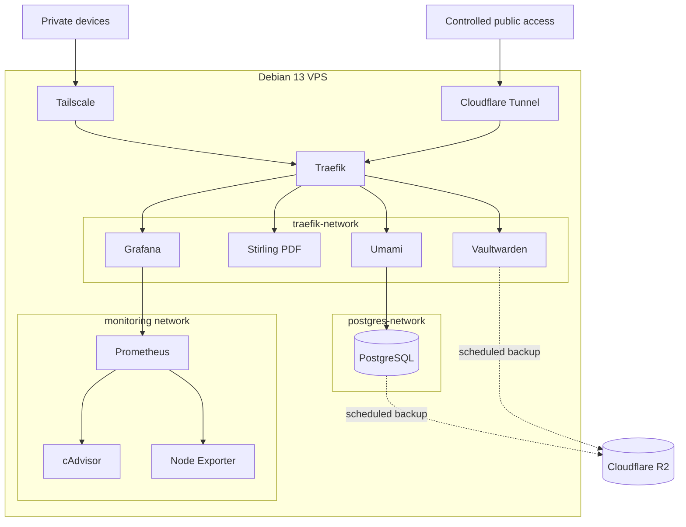

## Overview

Yawilab is my self-managed server for the applications and infrastructure I use every day. It runs Debian 13, and each service is deployed as a Docker Compose project so I can operate, upgrade, and recover it independently.

This project is less about hosting a single application and more about owning the whole system around my applications: private access, routing, persistent storage, monitoring, and backups.

## Architecture

Tailscale is the private network layer. Traefik listens on the VPS's Tailscale address instead of every network interface, then routes HTTPS traffic to containers through a shared Docker network. A Cloudflare Tunnel also joins that network for services that need a controlled public path without directly exposing the host.

The stack is split into two main Docker networks:

- `traefik-network` connects Traefik to web applications that need HTTP routing.
- `postgres-network` connects PostgreSQL only to services that need database access.

Monitoring has its own internal network. Grafana can reach Prometheus, while Prometheus collects container metrics from cAdvisor and host metrics from Node Exporter. Only the Grafana interface joins the routing network.

In simplified form, requests, metrics, and backups move through the VPS like this:

## Applications

### Vaultwarden

Vaultwarden is the password manager I host for my daily use. Its persistent data lives outside the container, which keeps upgrades separate from the data and makes the service easier to back up and restore.

### Stirling PDF

Stirling PDF gives me a private toolbox for common PDF tasks, including conversion, editing, and OCR. Hosting it myself means documents do not need to be sent to an unrelated online converter.

### Umami

Umami provides privacy-focused analytics for my websites. It uses the VPS's PostgreSQL instance and is the main application that bridges the web-routing and database networks.

### Grafana and Prometheus

Grafana is the dashboard for the VPS. Prometheus collects time-series metrics, cAdvisor reports container resource usage, and Node Exporter reports host-level metrics such as CPU, memory, disk, and network activity.

## Operations and backups

I keep each part of the stack in its own directory with its own Compose file. This makes routine work safer: I can update one application without taking down the rest of the server, and image versions can be pinned when reproducibility matters.

Persistent data is backed up to Cloudflare R2 by scripts triggered with systemd timers. PostgreSQL produces both a logical `pg_dump` and an archive of its Docker volume, while Vaultwarden's data directory is archived separately. Backups are timestamped, validated where possible, and rotated automatically.

## What I learned

Running VPS has helped me treat infrastructure as a product instead of a one-time setup. Deploying an application is only one part of the job; access boundaries, service isolation, observability, backups, and recovery procedures matter just as much.

The result is a small homelab-style platform on a VPS: private by default through Tailscale, organized as independent containers, observable through Grafana, and recoverable from off-site backups.
